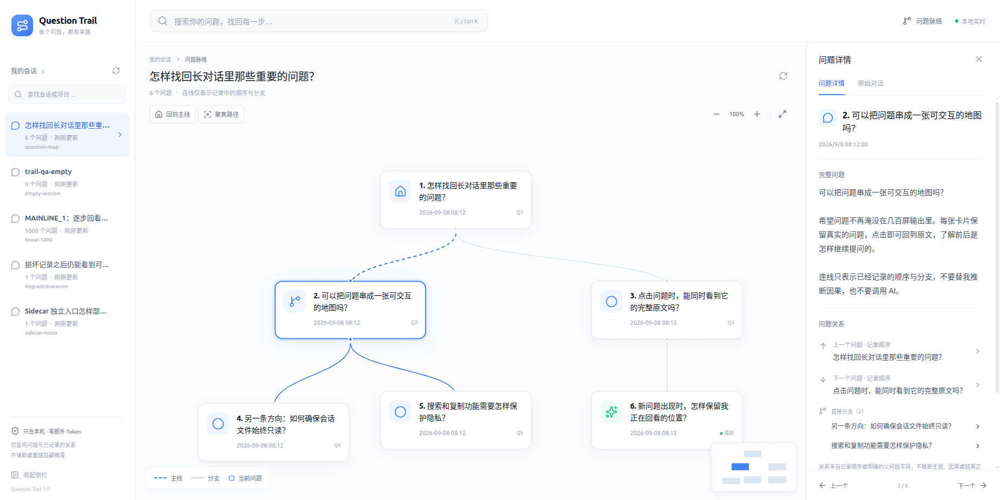

# Codex Navigator

快速找回你的 Codex 历史问题与回复。安装一次，任选终端阅读、网页阅读或 **Question Trail 问题画布**：

```bash
codex-nav                 # 终端版：直接在终端里使用，无需浏览器
codex-nav --web --port 0   # 网页版：在本机浏览器里阅读
codex-trail               # 问题画布：看清一路问过什么，点击节点回看
```

安装并配置好 PATH 后，**在任意目录输入上述命令即可，不需要进入 Codex Navigator 源码文件夹**。

- **找会话**：默认只列主会话，按项目、标题或 ID 搜索。
- **读过程**：浏览问题、工具活动和最终回复，支持复制。
- **看脉络**：Question Trail 用可拖拽、缩放的问题卡片与曲线连接展示真实顺序和有证据的分支。
- **跨会话找问题**：Question Trail 支持本地问题搜索、前后跳转、原始对话与路径聚焦。
- **跟进进度**：实时更新，翻阅历史时不打断阅读位置。

不修改 Codex、不上传会话，不需要额外账号或 API Key。

这不是聊天客户端、AI 总结工具或模型思维链查看器：不生成标题、不推断语义关系，也不能从网页向 Codex 发送指令。标题直接截取已有问题；无法确认分支时显示单主线。



## 让你的 Agent 帮你安装

把[本项目仓库链接](https://github.com/MIINGYANG/Codex-Navigator)（或已有源码目录）和下面这句话交给你的编程 Agent：

> 请阅读这个项目的 README 和 docs/agent-setup.md，帮我安装 Codex Navigator 和 Question Trail；我授权你备份并最小修改当前用户的 shell 启动配置，持久加入正确安装路径，验证新终端在任意目录直接运行 codex-nav 和 codex-trail 无需手动 source，再让我选择终端阅读、网页阅读或问题画布并交付使用方式；不要修改或上传 Codex 会话，需要管理员权限、覆盖已有安装或其他系统变更时先询问我。

你不需要提前了解 Rust；Agent 会检查已有工具链，完成安装和持久 PATH 配置，并验证新终端可用。上面的指令已授权必要的用户级 shell 配置修改，不需要每次手动 `source`。请使用本仓库源码，不要使用来源不明的同名安装包。

## 自己安装

目前已验证 Linux x86_64；macOS / Windows 尚未完成实机验证。源码构建需要 Rust 1.88+ 和 C 链接器，建议使用当前 stable Rust。

仅首次从源码安装时，需要在项目目录运行。先确认 Rust 与 Cargo 均为 1.88 或更新版本，再安装；命令不存在或版本过旧时先看下方“安装常见问题”：

```bash
rustc --version
cargo --version
cargo install --path . --locked
```

这会安装独立的 `codex-nav` 和 `codex-trail` 命令，而不只是生成项目里的构建文件。以后打开任意终端、在任意目录启动即可，无需 `cargo run`，也无需回到源码目录。Navigator 1.4.0 随包提供 Question Trail 1.0.0。

若提示找不到命令，Linux 默认安装的 Bash/Zsh 用户可先在当前终端运行：

```bash
export PATH="$HOME/.cargo/bin:$PATH"
codex-nav --version
codex-trail --version
```

要让新终端自动生效，默认 rustup 安装且 `~/.cargo/env` 存在时，Bash 用户在 `~/.bashrc` 中添加一次以下内容（Zsh 使用实际的 `.zshrc`，默认在 `~/.zshrc`）：

```bash
[ -f "$HOME/.cargo/env" ] && source "$HOME/.cargo/env"
```

保存后新开终端运行 `codex-nav --version`，无需再次手动 `source`。已有终端不会自动更新，可重新打开。其他 shell 或自定义安装目录应配置其实际 PATH；使用上面的 Agent 指令时，这些步骤由 Agent 完成。

两种网页入口都会尝试自动打开浏览器，`--port 0` 自动选择空闲端口。安装时需要下载依赖；前端资源已内嵌，安装和运行都不需要 Node.js，运行时不需要外网。

## 怎么用

### Question Trail：问题画布

```bash
codex-trail                            # 打开最新会话，默认本机端口 47321
codex-trail --no-open                  # 只打印私有访问地址
codex-trail --port 0                   # 自动选择空闲端口
codex-trail --codex-home /path/to/codex # 指定本机数据目录
codex-trail doctor                     # 只读检查目录和会话可读性
```

左侧切换会话；中央点击问题打开完整原文与前后关系，双击聚焦相邻节点。拖动背景平移、滚轮缩放，右下角小地图快速定位；“聚焦路径”淡化无关节点，“回到主线”恢复全图。右侧“原始对话”查看已记录的最终回复与折叠工具摘要。继续使用 Codex 时自动更新，查看历史不会被新问题抢走位置，点击新增提示才跳到最新。

| 快捷键 | 操作 |
| --- | --- |
| `Ctrl/Cmd + K` | 跨会话搜索问题 |
| `Enter` | 打开选中的搜索结果 |
| `Esc` | 关闭搜索或详情 |
| `F` | 适配全图 |
| `↑ / ↓` | 详情面板内查看上一个 / 下一个问题 |

### Navigator：终端与网页阅读

1. 在你平时使用 Codex 的机器上启动 Navigator；终端版在另一个交互式终端运行，不占用 Codex 的终端。
2. 选择主会话：终端版用 `j/k` 或方向键选择、`Enter` 打开；网页版直接点击。
3. 按 `/` 搜索问题，按 `f` 定位最终回复；网页版也可点击“最终回复”。
4. 网页版点击右上方“问题脉络”（或按 `v`）：沿横向路径选择问题，下方点击步骤查看原文；方向键选择问题/步骤，`Enter` 打开，`f` 查看当前问题的最终回复。随时切回“阅读”。

Navigator 原有脉络连线表示**记录先后顺序，不代表因果关系或模型内部思维链**。它保留分页阅读体验：每页最多 100 个问题、每组最多 64 条活动，可以继续翻页；需要中央画布与跨会话搜索时使用 `codex-trail`。

常用快捷键：`/` 搜索、`j/k` 移动、`g/G` 当前区域首尾、`f` 最终回复、`s` 返回会话列表、`?` 帮助。终端版用 `Tab` 切换时间线/正文焦点；网页版点击目录或正文切换操作区域。

```bash
codex-nav --all                        # 终端查看更早的主会话
codex-nav --web --port 0 --all          # 网页查看更早的主会话
codex-nav --web --port 0 --no-open      # 不自动打开浏览器，打印访问地址
codex-nav doctor                       # 环境诊断
```

终端版按 `q` 退出（搜索时先按 `Esc`），也可按 `Ctrl+C`。两个网页入口请保留启动它的终端，按 `Ctrl+C` 停止；关闭网页不会停止服务。如果由 Agent 后台启动，让它告诉你如何停止该进程。退出都不影响 Codex。

## 安装常见问题

**提示 `cargo: command not found`，或 `lock file version 4 requires…`？**

前者可能是尚未安装工具链，也可能只是 PATH 未配置；后者表示当前调用的 Cargo 太旧。不要直接照系统提示安装 `apt` 里的旧版本：例如 Cargo 1.75 不满足本项目要求。

如果已通过 rustup 安装工具链，且 `~/.cargo/env` 存在，Bash/Zsh 用户先执行：

```bash
source "$HOME/.cargo/env"
command -v cargo
cargo --version
rustc --version
```

确认两者均为 1.88+ 后，再在源码目录执行 `cargo install --path . --locked`。如果仍过旧，需要通过 rustup 升级工具链；如果 env 文件不存在，先检查是否使用了自定义安装目录，确实未安装时再通过 rustup 安装，也可交给 Agent 处理。

不要删除或改写 `Cargo.lock`，也不要加 `-Znext-lockfile-bump` 绕过错误。已有系统 Rust 不必因此卸载；关键是当前终端选中了符合要求的工具链。若仅当前终端生效，请按上方 PATH 说明配置新终端。

**网页打不开、端口已占用或找不到会话？** 用 `--port 0` 重新启动并打开打印的完整地址。Question Trail 执行 `codex-trail doctor`，检查 `--codex-home` / `CODEX_HOME` 是否指向实际数据目录；缺少目录时先在这台机器运行一次 Codex 并提问，然后重新扫描。浏览器与程序应在同一台机器，关闭服务后旧地址失效。

## 隐私与会话发现

- **读取本机数据**：优先使用 Question Trail 的 `--codex-home`，其次 `CODEX_HOME`，否则 `~/.codex`；只扫描其中 `sessions/` 的本地 rollout。Question Trail 跨项目、跨日期展示会话，默认打开最近更新的一条；Navigator 默认列近期主会话，用 `--all` 查看更早记录。
- **网页版只在本机访问**：使用程序打印的完整地址，其中带有临时令牌，不要分享。不能直接从其他电脑或手机连接；终端版不启动网页服务。
- **没有外传**：Your Codex sessions stay on your computer. Question Trail does not call an AI model. Question Trail does not upload your conversations. 不使用遥测、embedding、运行时 CDN 或远程字体；不读认证密钥，不改写 Codex 文件。
- **不会揭示内部推理**：问题原文按纯文本呈现，原始对话只显示已经记录的可见内容；不读取、推断或重建模型隐藏思维链。

## 已知限制

- **不判断答案正确性**：正常结束与活动错误分开显示，最终结果由你阅读回复判断。
- **长历史可能省略**：为控制内存，部分旧正文会显示省略提示，原文件不变；没有可靠标记时不会猜测最终回复。Markdown 为安全子集，不加载图片附件。
- **分支需要证据**：顺序不是因果；只有可可靠识别的持久化父子关系才会画成分支，无法确定分叉点时不猜测。未来 Codex schema 可能需要适配，坏行与未知事件会降级提示。
- **搜索有预算**：全局索引最多保留 100,000 项 / 32 MiB 可搜索文本，单次最多返回 100 个匹配；大文件后台索引最多扫描 1 GiB，超限会提示。未打开且发生变化的文件需重新扫描自身，已打开的会话复用增量模型，不重扫未变的历史。旧正文被省略时只能搜索保留的预览。
- **本机优先**：不同步其他设备记录，不支持多人协作、公网访问或登录。当前仅 Linux x86_64 完成实机验证；移动端可阅读，但不是移动应用。问题画布 v1.0 使用浅色主题。

## 开发与测试

普通用户不用执行这些命令。修改前端需要 Node.js 22.13+；后端复用 Rust 只读流式解析和本地服务，画布使用 React、TypeScript、React Flow，生产资源随 binary 打包。

```bash
npm ci
npm run build:trail        # 修改画布后重新生成内嵌资源
npm test
npm run lint
npm run format:check
cargo fmt --all -- --check
cargo clippy --all-targets --locked -- -D warnings
cargo test --locked
cargo build --release --locked
./target/release/codex-trail --port 0
# 可选验收（需要本机 Chrome / CDP Proxy 测试环境）
node scripts/trail_qa.mjs
python3 scripts/terminal_qa.py target/release/codex-nav
# 合成 100 MiB / 1000 问题的 API 基准
cargo run --release --example trail_benchmark
```

测试使用人工合成会话，不写入真实 Codex 数据。浏览器验收脚本需本机浏览器测试环境；只完成 Rust 测试不等于完成视觉验收。

## 更多

[Agent 安装与自检](docs/agent-setup.md) · [版本记录](CHANGELOG.md)

[MIT License](LICENSE)。独立社区工具，与 OpenAI 官方项目无隶属关系。
